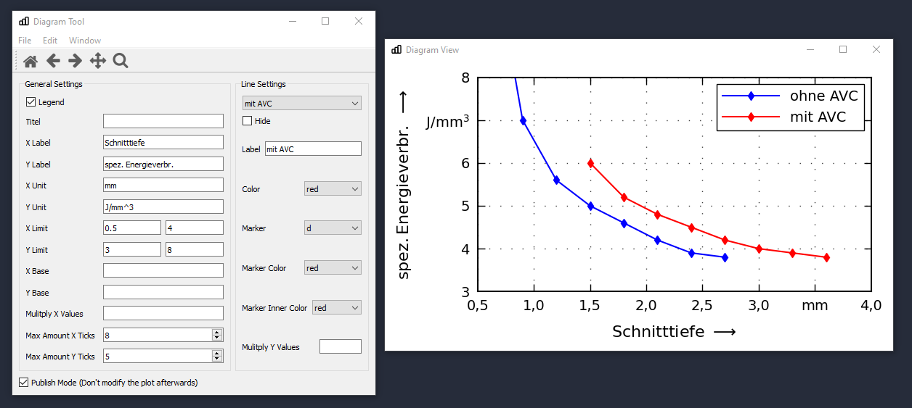

# DiagramTool

A Tool to create diagrams for papers / printed publications with a predefined style.

## Motivation
I created this tool to generate diagrams for university homework, thesis and papers. I dislike the default styling by matplotlib and therefore had to change the styling of every diagram I created manually. This involved a lot of copy pasting and was just messy overall. This tool aims to solve this by giving the user an UI for diagram creation and applying a predefined style.

**Note:**
I'm aware there are libraries to change the default matplotlib style, like seaborn, but I didn't find one that exactly what I wanted.

## Getting Started

(Optional) Create virtual environment.

First install the required dependencies with `pip install -r requirements.txt`.

Start the tool by exectuting `python DiagramTool.py`.

## Notes

Currently only CSV files are supported. The predefined diagram style is in german notation (',' as decimal place instead of '.'). In the future I'll maybe add an option for changing this behavior.